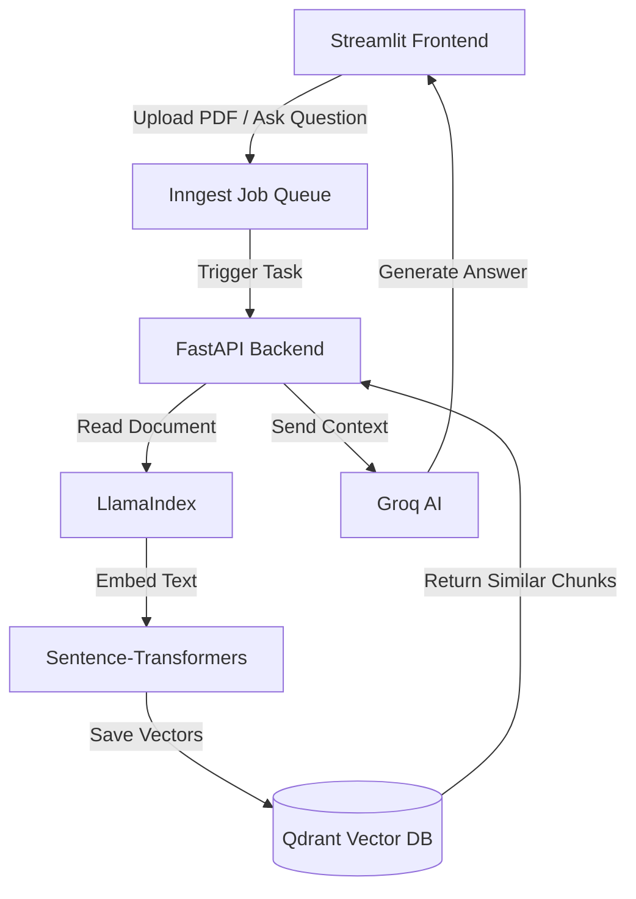

# Document AI Assistant (Enterprise RAG Pipeline)


An enterprise-grade **Retrieval-Augmented Generation (RAG)** application. This platform allows users to securely upload private PDF documents, embed them into a local vector database, and query them instantly using AI to extract actionable insights.

---

## System Architecture

This project is built using a fully decoupled, asynchronous, event-driven architecture. By utilizing **Inngest** for background job queues, the Streamlit frontend remains perfectly responsive even when processing massive 100+ page PDFs.



---

## Complete Tech Stack

### Frontend
* **Streamlit:** Python-based UI framework styled with a custom dark-mode B2B SaaS theme configuration.

### Backend & Orchestration
* **FastAPI & Uvicorn:** High-performance web framework acting as the core orchestrator.
* **Inngest:** Event-driven background job queue ensuring robust error handling, automatic retries, and non-blocking UI interactions.

### Data & AI Layer
* **LlamaIndex:** Used for PDF ingestion and intelligent overlapping sentence chunking.
* **Sentence-Transformers:** Local, zero-cost vector embedding generation utilizing the HuggingFace `all-MiniLM-L6-v2` model.
* **Groq API:** Blazing fast LLM inference running the `groq/compound` model via the standard OpenAI SDK.
* **Qdrant:** High-performance Vector Database operating in persistent local storage mode.

---

## How to Run Locally

### 1. Prerequisites
Ensure you have Python 3.12+ installed.
Create a `.env` file in the root directory and add your Groq API Key:
```env
GROQ_API_KEY=your_api_key_here
```

### 2. Installation
Create a virtual environment and install the required dependencies:
```bash
python -m venv .venv
.venv\Scripts\activate
pip install -r requirements.txt
```

### 3. Starting the Services
This application requires three separate processes running simultaneously. Open three terminal windows and run the following:

**Terminal 1 (Background Queue):**
```bash
npx inngest-cli@latest dev -u http://127.0.0.1:8000/api/inngest
```

**Terminal 2 (FastAPI Backend):**
```bash
.venv\Scripts\activate
uvicorn main:app --reload --port 8000
```

**Terminal 3 (Streamlit Frontend):**
```bash
.venv\Scripts\activate
streamlit run app.py
```
