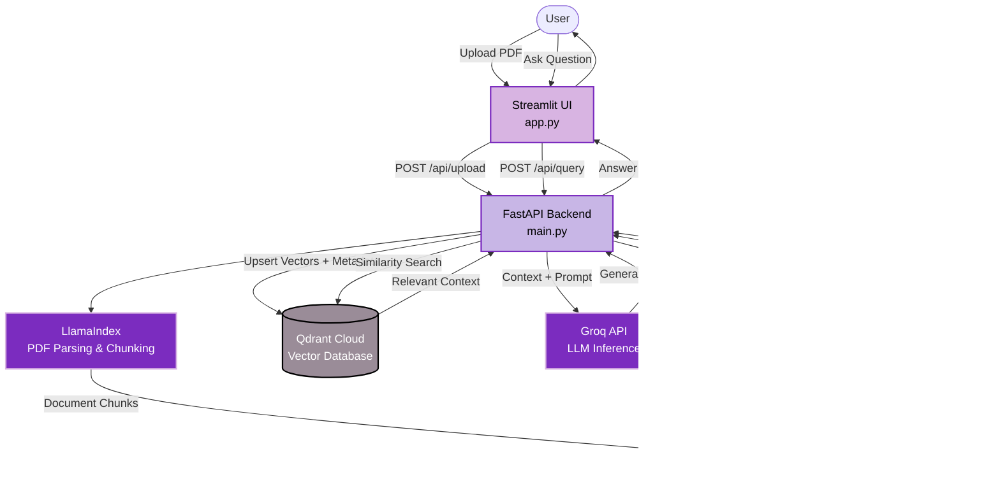

# Document AI Assistant

> **A Retrieval-Augmented Generation (RAG) platform that enables users to upload PDF documents and interact with their content through natural-language questions.**


The system combines **LlamaIndex, Hugging Face embeddings, Qdrant vector search, FastAPI, Streamlit, and Groq** to retrieve relevant document context and generate grounded responses with source references.

---

## Live Demo

> **Application URL:** [https://doc2chat-ai.streamlit.app/](https://doc2chat-ai.streamlit.app/)


---

## Overview

Document AI Assistant transforms unstructured PDF documents into a searchable semantic knowledge base. 

Instead of relying solely on an LLM's pretrained knowledge, the system retrieves relevant passages from the uploaded documents and provides them as context to the LLM before generating a response.

### Key Capabilities

* **Document Processing:** Upload and process PDF documents securely.
* **Semantic Search:** Lightning-fast vector-based retrieval using Qdrant.
* **Context-Aware Q&A:** Grounded LLM-powered response generation.
* **Cloud AI:** Serverless embedding generation via Hugging Face.
* **Traceability:** Exact source and context references for retrieved information.
* **Decoupled Design:** Lightweight, independent microservices architecture.

---

## Architecture

The application uses a decoupled cloud architecture consisting of independent frontend, backend, vector storage, embedding, and LLM services.

* **Frontend:** Streamlit *(Deployed on Streamlit Community Cloud)*
* **Backend:** FastAPI *(Deployed on Render)*
* **Vector Database:** Qdrant Cloud
* **Embedding Service:** Hugging Face Serverless Inference API
* **Embedding Model:** `all-MiniLM-L6-v2`
* **LLM Provider:** Groq

### System Flow



---

## Running Locally

To run the full dual-service architecture on your local machine, you will need two terminal windows.

### 1. Start the FastAPI Backend
```bash
# Activate your virtual environment
.venv\Scripts\activate

# Start the API server on port 8000
uvicorn main:app --reload --port 8000
```

### 2. Start the Streamlit Frontend
```bash
# In a second terminal window, activate the environment
.venv\Scripts\activate

# Launch the user interface
streamlit run app.py
```
*Note: The frontend will automatically open in your browser at `http://localhost:8501`.*
